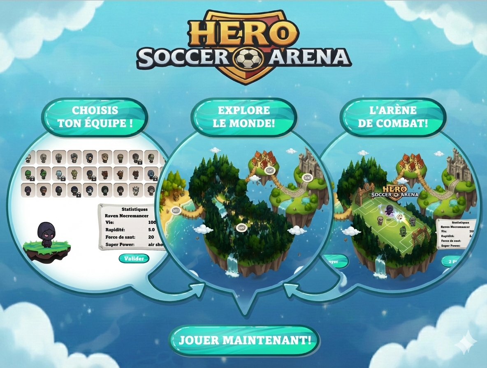

# ⚽ Hero Soccer Arena

**Hero Soccer Arena** est un jeu de football arcade en 2D mêlant action, physique et combats.  
Inspiré de Super Smash Bros et des Head Soccer, affrontez vos adversaires dans une arène où seuls les plus habiles survivront.

---

## 🎮 Concept du jeu

  <table>
    <tr>
      <td width="50%" valign="top">
        
- Matchs de football **1v1** en arène
- Scorer le plus de but avant la fin du temps impartis
- Gameplay rapide et nerveux
- Interactions avancées entre les joueurs et la balle
- Système de dégâts, mort temporaire et invincibilité
- Capacités spéciales propres aux personnages

  </td>
      <td width="50%">
        
      </td>
    </tr>
  </table>

---

## 🕹️ Contrôles (Clavier)

  <table>
    <tr>
      <td width="50%" valign="top">

### Joueur 1

| Action | Touche |
|--------|--------|
| Se déplacer à gauche | `Q` |
| Se déplacer à droite | `D` |
| Sauter | `Z` |
| Tirer / Frapper la balle | `S` |
| Dash (en l'air) directionnel | `Z` ou `Q` + `SPACE` |
| Pouvoir spécial | `E` |

*(Les contrôles peuvent évoluer selon le développement)*

  </td>
      <td width="50%">
        
      </td>
    </tr>
  </table>

---

## ⚙️ Fonctionnalités principales

- ✅ Selection du Héro
- ✅ Map avec les différents niveaux
- ✅ Déplacements fluides (run, jump, dash)
- ✅ Système de collisions précis (tête, corps, pieds)
- ✅ Balle avec vitesse, impulsion et dégâts
- ✅ États du joueur (Idle, Run, Jump, Kick, Dash, Dying)
- ✅ IA modulable (agressivité, temps de réaction, cible le ballon et le joueur)

---

## 🛠️ Technologies utilisées

- **Java**
- **LibGDX**
- **Box2D**
- Architecture orientée composants
- Animations Textures
